# AWS Cloud Fun Fact Generator

A **serverless web application** built on AWS that generates and displays random cloud-related fun facts.

This project demonstrates practical usage of **AWS Lambda, API Gateway, DynamoDB, IAM, and AWS Amplify** in building a simple yet complete cloud-based application.

---

# Project Overview

When a user clicks a button on the website:

1. User interacts with frontend hosted on Amplify
2. Request is sent via API Gateway
3. Lambda function processes the request
4. Random fact is fetched from DynamoDB
5. Response is sent back to frontend
6. User sees a cloud fun fact instantly

---

# Architecture

```
User (Browser)
     │
     ▼
AWS Amplify (Frontend Hosting)
     │
     ▼
API Gateway (GET /getfact)
     │
     ▼
AWS Lambda
     │
     ▼
DynamoDB (Cloud Facts Table)
```

---

# AWS Services Used

* **AWS Amplify** – Frontend hosting
* **Amazon API Gateway** – HTTP API endpoint
* **AWS Lambda** – Backend logic
* **Amazon DynamoDB** – NoSQL database
* **AWS IAM** – Role & permission management

---

# Application Flow

1. User opens the hosted website (Amplify)
2. Clicks “Generate Fact” button
3. API Gateway receives GET request
4. Lambda function executes:

   * Reads data from DynamoDB
   * Selects a random fact
   * Returns response
5. Fact is displayed on UI

---

# Steps I Followed In This Project

## 1. DynamoDB Setup

Created a table with primary key **FactID**

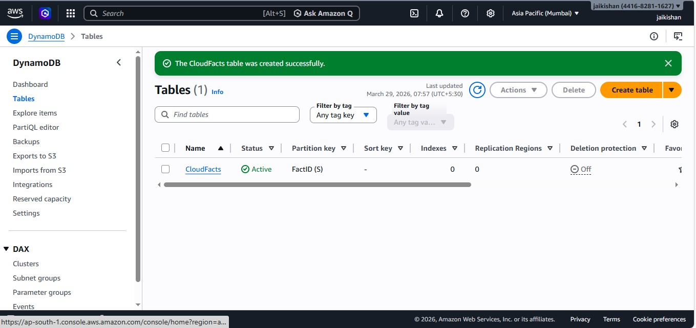

Inserted sample cloud facts into the table

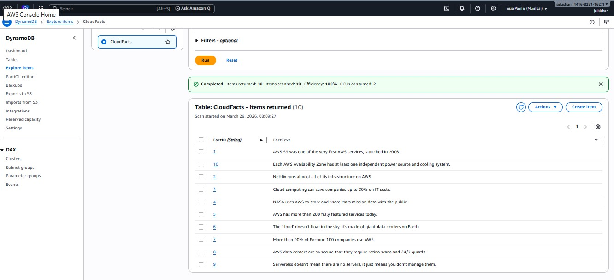

---

## 2. IAM Role Setup

Created an IAM role for Lambda with permissions:

1. AmazonDynamoDBFullAccess
2. AWSLambdaBasicExecutionRole

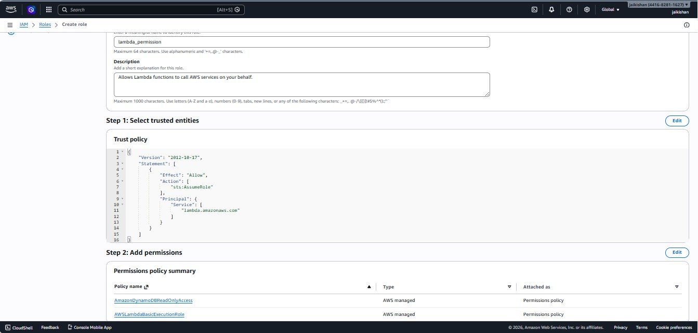

---

## 3. Lambda Function

Created a Lambda function to fetch random facts from DynamoDB.

Used runtime: **Python 3.x** (can also use Node.js/Java)

Attached IAM role to Lambda.

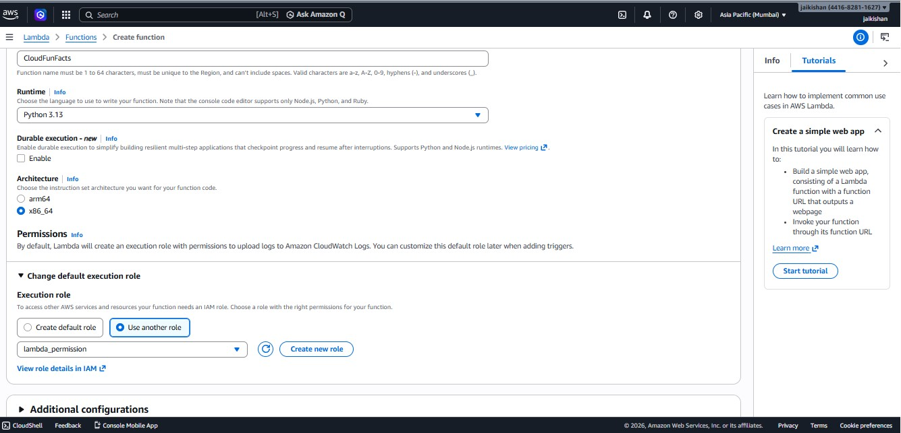

Deployed the function code

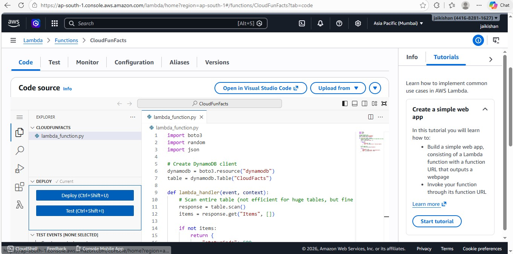

---

## 4. API Gateway

Created an HTTP API and integrated with Lambda

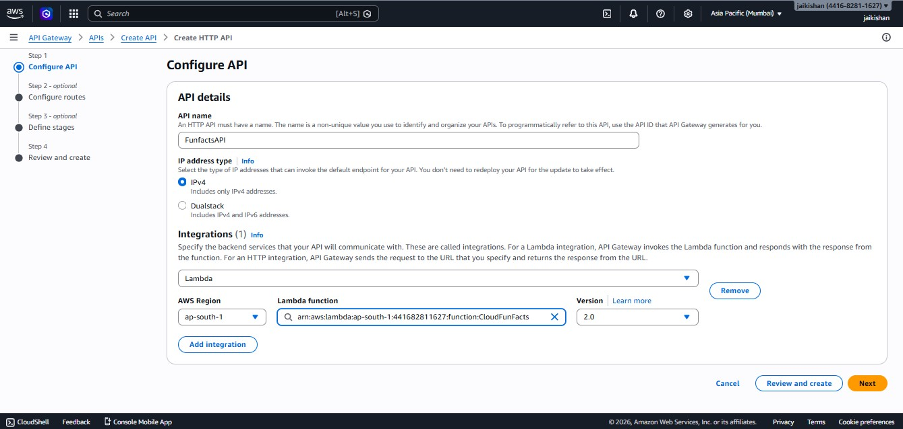

Added route:

* Method: **GET**
* Path: **/getfact**

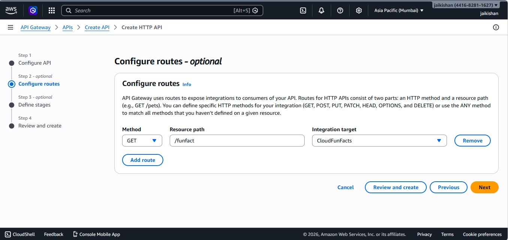

Retrieved Invoke URL

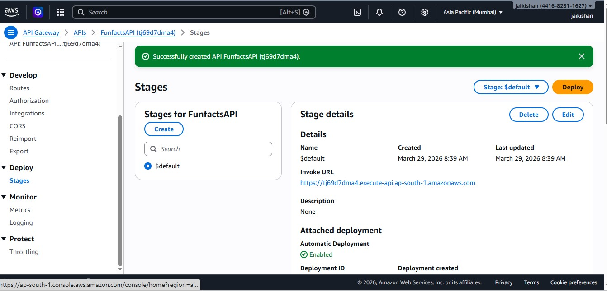

Enabled CORS for frontend integration

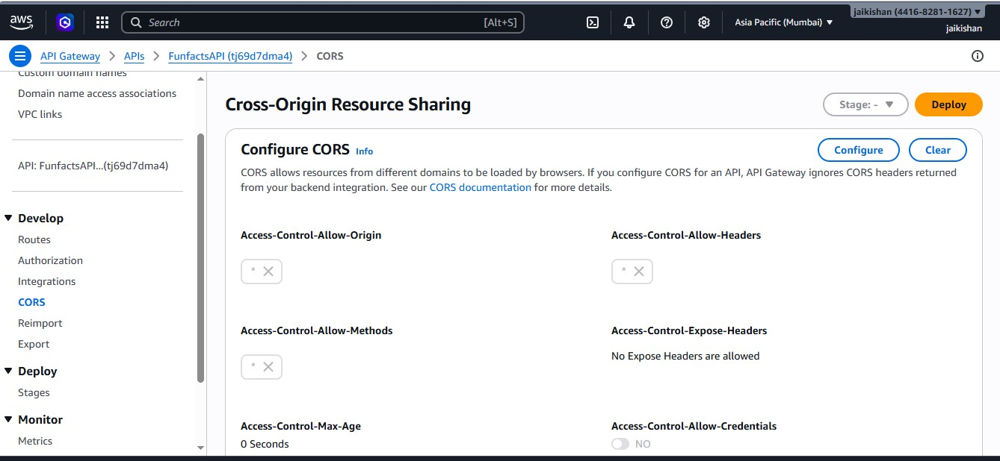

---

## 5. Testing

Tested API using Postman

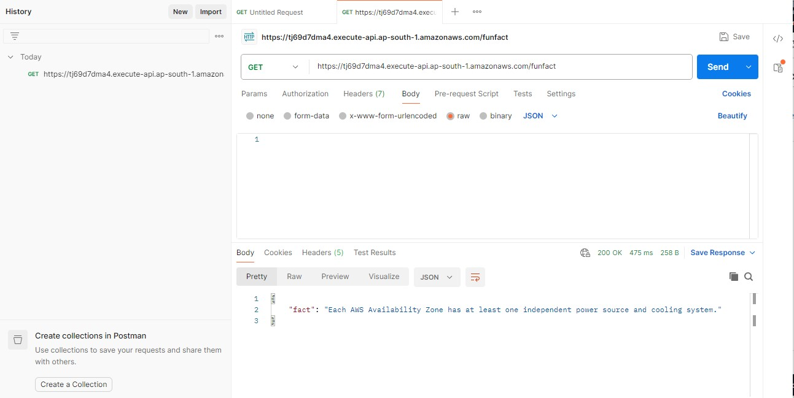

---

## 6. Frontend Deployment (Amplify)

Selected deployment without Git in Amplify

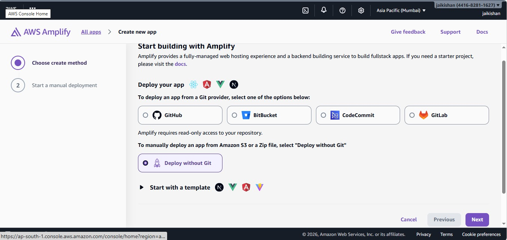

Converted HTML into zip and deployed

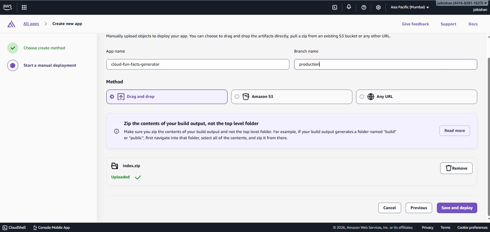

Application successfully deployed

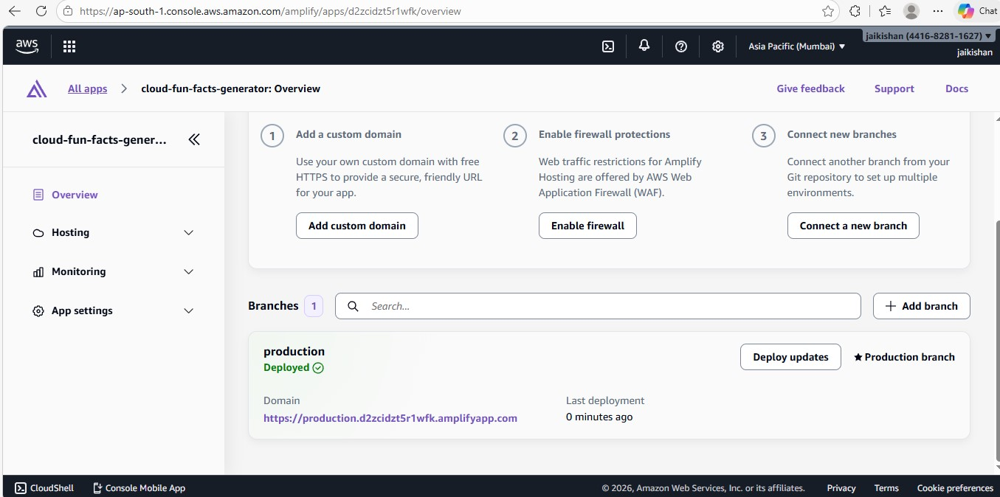

---

## 7. Output

Testing the deployed web app

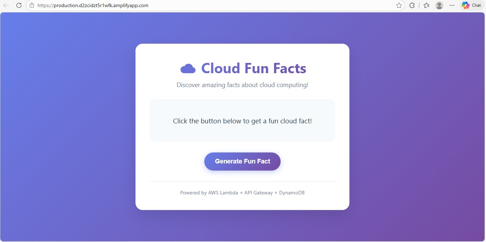

Successful response from API

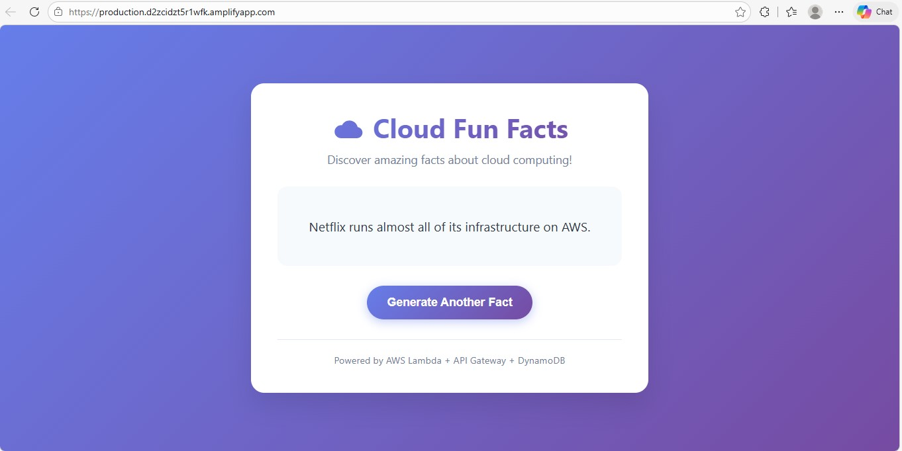

---

# IAM Permissions

Lambda is assigned an IAM role with permissions to:

* Read data from DynamoDB
* Write logs to CloudWatch

---

# Testing

* API tested using Postman
* End-to-end testing via Amplify hosted site

---

# Key Learnings

* Serverless architecture basics
* API creation using API Gateway
* Lambda and DynamoDB integration
* Hosting frontend using Amplify
* Handling CORS for frontend-backend communication

---

# Future Improvements

* Add categories for facts
* Improve UI/UX
* Add caching for faster responses
* Add authentication (Cognito)
* Deploy using Infrastructure as Code

---

# Challenges Faced & Solutions During Project

## 1. CORS Issues

Problem:
Frontend could not call API due to CORS restrictions.

Solution:
Enabled CORS in API Gateway and configured required headers.

---

## 2. Lambda Permissions Issue

Problem:
Lambda was unable to access DynamoDB.

Solution:
Attached correct IAM role with DynamoDB permissions.

---

## 3. API Not Returning Data

Problem:
Incorrect integration or route setup in API Gateway.

Solution:
Verified method (GET), route path, and Lambda integration.

---

## 4. Amplify Deployment Issues

Problem:
Frontend not loading properly after deployment.

Solution:
Ensured correct file structure and zipped only required files.

---

# Conclusion

This project demonstrates how to build a **simple and scalable serverless application** using AWS services. It is ideal for beginners to understand real-world cloud integration.

---

# Author

**Korada Jaikishan**
Cloud Computing Learner | AWS Beginner
--------------------------------------
